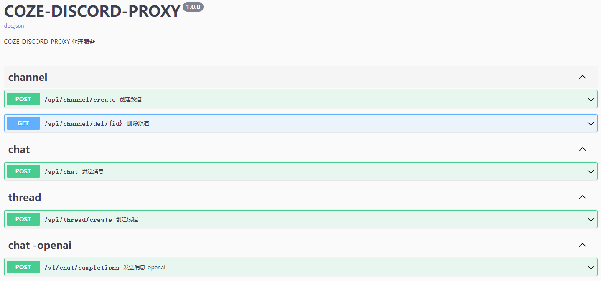
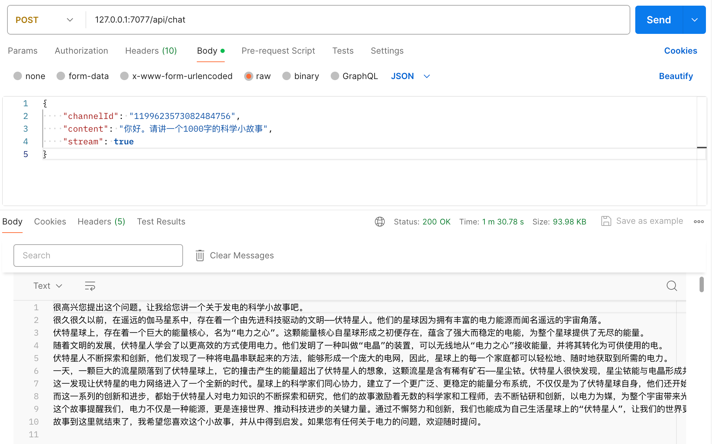
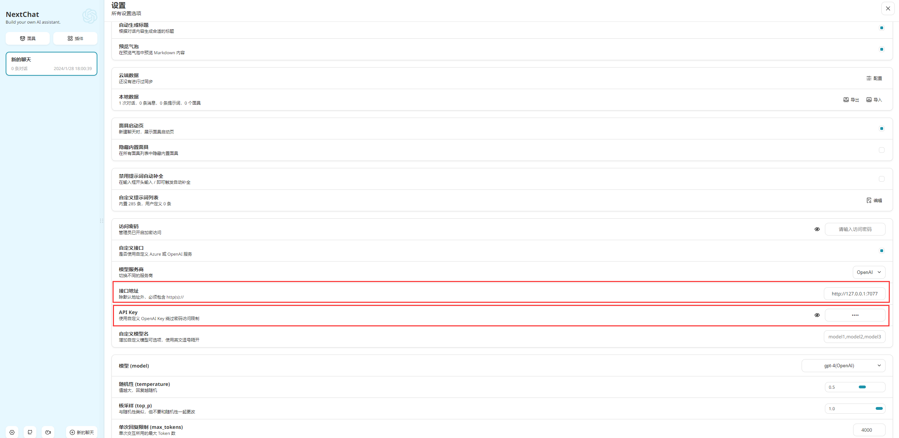

<p align="right">
    <a href="./README.md">中文</a> | <strong>English</strong>
</p>

<div align="center">

# coze-discord-proxy

_Act as a proxy for the Discord conversation Coze-Bot, implementing the GPT-4 model request in the form of an API, providing functionalities such as dialogue, text-to-image, image-to-text, and knowledge base retrieval_

_If you find it interesting, don't forget to hit the 🌟_

📄<a href="https://cdp-docs.pages.dev" style="font-size: 15px;">CDP Project Documentation Site</a>(Must-See Tutorial)

🐞<a href="https://t.me/+LGKwlC_xa-E5ZDk9" style="font-size: 15px;">CDP Project-Discussion Group</a>(Communication)

📢<a href="https://t.me/+0fYkYY_zUZYzNzRl" style="font-size: 15px;">CDP Project-Notification Channel</a>(Notification)


</div>

## Features

- [x] Perfectly adapts to dialogue panels such as `NextChat`, `one-api`, `LobeChat`.
- [x] Perfectly supports dialogue isolation.
- [x] Dialogue interface supports streaming return.
- [x] Supports creating `discord` category/channel/thread.
- [x] Supports the dialogue interface aligned with `openai` (`v1/chat/completions`) (also supports `dall-e-3`text-to-image) (supports specifying `discord-channel`).
- [x] Supports the picture-to-text/image-to-image/file-to-text interface aligned with `openai` (`v1/chat/completions`) (according to the request format of `GPT4V` interface [supports `url` or `base64`]) (supports specifying `discord-channel`).
- [x] Supports the `dall-e-3` text-to-image interface aligned with `openai` (`v1/images/generations`).
- [x] Supports the daily `9` o'clock scheduled task to automatically activate the bot.
- [x] Supports configuring multiple discord user `Authorization` (environment variable `USER_AUTHORIZATION`) for request load balancing (**Currently each discord user calling coze-bot has a [limit](#Limitations) within 24h, you can configure multiple users to achieve superimposed request times and request load balancing**).
- [x] Supports configuring multiple coze bots for response load balancing (specified by `PROXY_SECRET`/`model`) For details, see [Advanced Configuration](#Advanced-Configuration).

### API Documentation:

`http://<ip>:<port>/swagger/index.html`

<span></span>

### Example:

<span></span>

## How to Use

1. Open [Discord official website](https://discord.com/app), after logging in, click on Settings-Advanced Settings-Developer Mode-Turn On.
2. Create a discord server, right-click on this server to select `Copy Server ID (GUILD_ID)` and record it, create a default channel in this server, right-click on this channel to select `Copy Channel ID (CHANNEL_ID)` and record it.
3. Open [Discord Developer Platform](https://discord.com/developers/applications) and log in.
4. Create a new application-Bot, which is `COZE-BOT`, and record the `token` and `id (COZE_BOT_ID)` specific to this bot. This bot will be the bot to be managed by coze.
5. Create a new application-Bot, which is `CDP-BOT`, and record the `token (BOT_TOKEN)` specific to this bot. This bot is the bot that listens to discord messages.
6. Both bots open corresponding permissions (`Administrator`) and invite them into the created discord server (the process is not detailed here).
7. Open [Discord official website](https://discord.com/app), enter the server, press F12 to open the developer tool, send a message in any channel, find the request `https://discord.com/api/v9/channels/1206*******703/messages` in Developer Tools-`Network`, get `Authorization(USER_AUTHORIZATION)` from the header of this interface and record it.
8. Open [Coze official website](https://www.coze.com) to create a bot and make personalized settings (note `Auto-Suggestion` is `Default/on` (default does not need to be changed)).
9. After the configuration is completed, choose to publish to discord, fill in the `token` of `COZE-BOT`, after the publication is completed, you can see `COZE-BOT` online and can be used in the discord server.
10. Use the parameters recorded above to start configuring [environment variables](#Environment Variables)and [deploy](#Deployment) this project.
11. Visit the API documentation address, you can start debugging or integrating other projects.

## How to Integrate NextChat

Fill in the interface address (ip:port/domain) and API-Key (`PROXY_SECRET`), and the others can be filled in and selected at will.

> If you haven't set up the NextChat panel yourself, here is one that has been set up and can be
> used [NextChat](https://ci.goeast.io/)

<span></span>

## How to Integrate one-api

Fill in `BaseURL` (ip:port/domain) and Secret Key (`PROXY_SECRET`), and the others can be filled in and selected at will.

<span></span>

## Deployment

### Deployment Based on Docker-Compose (All In One)

```shell
docker-compose pull && docker-compose up -d
```

#### docker-compose.yml

```docker
version: '3.4'

services:
  coze-discord-proxy:
    image: deanxv/coze-discord-proxy:latest
    container_name: coze-discord-proxy
    restart: always
    ports:
      - "7077:7077"
    volumes:
      - ./data:/app/coze-discord-proxy/data
    environment:
      - USER_AUTHORIZATION=MTA5OTg5N************uIfytxUgJfmaXUBHVI  # Must be modified to our discord user's authorization key (multiple please separate by ,)
      - BOT_TOKEN=MTE5OTk2************wUrUWNbG63w  # Must be modified to the Bot-Token that listens to messages
      - GUILD_ID=11************96  # Must be modified to the server ID where the two robots are located
      - COZE_BOT_ID=11************97  # Must be modified to the robot ID managed by coze
      - CHANNEL_ID=11************24  # [Optional] Default channel-(This parameter is only used to activate the robot in the current version)
      - PROXY_SECRET=123456  # [Optional] Interface key-Modify this line to the value of the request header check (multiple please separate by ,)
      - TZ=Asia/Shanghai
```

### Deployment Based on Docker

```docker
docker run --name coze-discord-proxy -d --restart always \
-p 7077:7077 \
-v $(pwd)/data:/app/coze-discord-proxy/data \
-e USER_AUTHORIZATION="MTA5OTg5N************uIfytxUgJfmaXUBHVI" \
-e BOT_TOKEN="MTE5OTk2************rUWNbG63w" \
-e GUILD_ID="11************96" \
-e COZE_BOT_ID="11************97" \
-e PROXY_SECRET="123456" \
-e CHANNEL_ID="11************24" \
-e TZ=Asia/Shanghai \
deanxv/coze-discord-proxy
```

Where `USER_AUTHORIZATION`,`BOT_TOKEN`,`GUILD_ID`,`COZE_BOT_ID`,`PROXY_SECRET`,`CHANNEL_ID` are replaced with your own.

If the above image cannot be pulled, you can try using GitHub's Docker image, just replace the above `deanxv/coze-discord-proxy`with `ghcr.io/deanxv/coze-discord-proxy`.

### Deploy to Third-Party Platforms

<details>
<summary><strong>Deploy to Zeabur</strong></summary>
<div>

> Zeabur's servers are abroad, automatically solving the network problem, and the free quota is also sufficient for
> personal use

Click one-click deployment:

[](https://zeabur.com/templates/GMU8C8?referralCode=deanxv)

**After one-click deployment, `USER_AUTHORIZATION`,`BOT_TOKEN`,`GUILD_ID`,`COZE_BOT_ID`,`PROXY_SECRET`,`CHANNEL_ID`variables also need to be replaced!**

Or manual deployment:

1. First **fork** a copy of the code.
2. Enter [Zeabur](https://zeabur.com?referralCode=deanxv), log in with github, and enter the console.
3. In Service -> Add Service, choose Git (the first time you use it, you need to authorize first), choose the repository you forked.
4. Deploy will start automatically, cancel first.
5. Add environment variables

   `USER_AUTHORIZATION:MTA5OTg5N************uIfytxUgJfmaXUBHVI`  The authorization key of the discord user who actively sends messages (multiple please separate by ,)

   `BOT_TOKEN:MTE5OTk2************rwUrUWNbG63w`  Bot-Token that listens to messages

   `GUILD_ID:11************96`  Server ID where the two robots are located

   `COZE_BOT_ID:11************97` Robot ID managed by coze

   `CHANNEL_ID:11************24`  # [Optional] Default channel-(This parameter is only used to activate the robot in the current version)

   `PROXY_SECRET:123456` [Optional] Interface key-Modify this line to the value of the request header check (multiple please separate by ,) (Same usage as openai-API-KEY)

Save.

6. Choose Redeploy.

</div>


</details>

<details>
<summary><strong>Deploy to Render</strong></summary>
<div>

> Render provides a free quota, and the quota can be further increased after binding the card

Render can directly deploy docker images, no need to fork the repository: [Render](https://dashboard.render.com)

</div>
</details>

## Configuration

### Environment Variables

1. `USER_AUTHORIZATION=MTA5OTg5N************uIfytxUgJfmaXUBHVI` - Authorization keys of the Discord users who initiate messages (for multiple keys, please separate with commas)
2. `BOT_TOKEN=MTE5OTk2************rUWNbG63w` - Bot-Token for listening to messages
3. `GUILD_ID=11************96` - Server ID where all Bots are located
4. `COZE_BOT_ID=11************97` - Bot-ID managed by Coze
5. `PORT=7077` - [Optional] Port number, default is 7077
6. `SWAGGER_ENABLE=1` - [Optional] Enable Swagger API documentation [0: No; 1: Yes] (default is 1)
7. `ONLY_OPENAI_API=0` - [Optional] Expose only those APIs that align with OpenAI [0: No; 1: Yes] (default is 0)
8. `CHANNEL_ID=11************24` - [Optional] Default channel - (In the current version, this parameter is only used to keep the Bot active)
9. `PROXY_SECRET=123456` - [Optional] Interface key - modify this line to validate the request header value (for multiple keys, please separate with commas) (consistent with the usage of OpenAI-API-KEY), **recommended to use this environment variable**
10. `DEFAULT_CHANNEL_ENABLE=0` - [Optional] Enable default channel [0: No; 1: Yes] (default is 0). Once enabled, each conversation will take place in the default channel, **session isolation will be ineffective**, **not recommended to use this environment variable**
11. `ALL_DIALOG_RECORD_ENABLE=1` - [Optional] Enable full context recording [0: No; 1: Yes] (default is 1). If turned off, only the last `content` with `role` as `user` in `messages` will be sent each time, **not recommended to use this environment variable**
12. `CHANNEL_AUTO_DEL_TIME=5` - [Optional] Automatic channel deletion time (seconds). This parameter determines the time to automatically delete the channel after each conversation (default is 5s). If set to 0, the channel will not be deleted, **not recommended to use this environment variable**
13. `COZE_BOT_STAY_ACTIVE_ENABLE=1` - [Optional] Enable the daily task of keeping the Coze-bot active at `9` o'clock [0: No; 1: Yes] (default is 1), **not recommended to use this environment variable**
14. `REQUEST_OUT_TIME=60` - [Optional] Request timeout for non-stream response in dialogue interface, **not recommended to use this environment variable**
15. `STREAM_REQUEST_OUT_TIME=60` - [Optional] Stream return timeout for each stream response in dialogue interface, **not recommended to use this environment variable**
16. `REQUEST_RATE_LIMIT=60` - [Optional] Limit the request rate of single IP per minute, default: 60 requests/min
17. `USER_AGENT=Mozilla/5.0 (Macintosh; Intel Mac OS X 10_15_7) AppleWebKit/537.36 (KHTML, like Gecko) Chrome/121.0.0.0 Safari/537.36` - [Optional] Discord user agent. Using your own may effectively prevent being banned. If not set, the author's default will be used. It is recommended to use this environment variable.
18. `NOTIFY_TELEGRAM_BOT_TOKEN=6232***********Niz9c` [Optional] Functions as the token for the TelegramBot notification (Notification events include: 1. Unavailability of user_authorization; 2. Risk control trigger by the BOT associated with BOT_TOKEN)
19. `NOTIFY_TELEGRAM_USER_ID=10******35` [Optional] The Telegram-Bot linked with NOTIFY_TELEGRAM_BOT_TOKEN forwards notifications to the Telegram-User associated with this variable (This variable must not be empty when NOTIFY_TELEGRAM_BOT_TOKEN is populated)
20. `PROXY_URL=http://127.0.0.1:10801` - [Optional] Proxy (only supports http)

## Advanced Configuration

### Configure Multiple Bots

1. Before deployment, create a `data/config/bot_config.json` file in the same directory as the `docker`/`docker-compose`deployment
2. Write this `json` file, the format of `bot_config.json` is as follows

```shell
[
  {
    "proxySecret": "123", // Interface request key (PROXY_SECRET) (Note: This key exists in the environment variable PROXY_SECRET so that this Bot can be matched!)
    "cozeBotId": "12***************31", // coze-managed bot ID
    "model": ["gpt-3.5","gpt-3.5-16k"], // Model name (array format) (corresponds to the model in the request parameter, if the model in the request does not match this json, it will throw an exception)
    "channelId": "12***************56"  // [Optional] discord channel ID (the robot must be in the server of this channel) (in the current version, this parameter is only used to activate the robot)
  },
  {
    "proxySecret": "456",
    "cozeBotId": "12***************64",
    "model": ["gpt-4","gpt-4-16k"],
    "channelId": "12***************78"
  },
  {
    "proxySecret": "789",
    "cozeBotId": "12***************12",
    "model": ["dall-e-3"],
    "channelId": "12***************24"
  }
]
```

3. Restart the service

> When there is this json configuration, it will match the `cozeBotId` in this configuration through the [request key]
> carried in the request header + `model` in the request body. If multiple matches are found, one will be randomly
> selected. The configuration is very flexible and can be configured according to your own needs.

The service deployed on a third-party platform (such as: `zeabur`) needs to [configure multiple bots]Please refer to [issue#30](https://github.com/deanxv/coze-discord-proxy/issues/30)

## Limitations

The current version of coze has implemented identification for each Discord user, and there is a usage limit for each user per different model on Discord, specifically as follows:

```
GPT-4 Turbo (128k) - 50 times/day
GPT-4 (8k) - 100 times/day
GPT-3.5 (16k) - 500 times/day
```

Multiple Discord user `Authorization` can be configured (refer to the [environment variable](#Environment-Variables) `USER_AUTHORIZATION`) to achieve cumulative request times and load balancing for requests.

## Q&A

Q: How to configure when the concurrency is high?

A: First, [configure multiple bots](#Configure-Multiple-Bots) for the service to serve as the response bot load, and then prepare multiple discord accounts to serve as the request load and invite them into the same server, get the `Authorization` of each account and separate them with English commas. Configure in the environment variable `USER_AUTHORIZATION`, at this time each request will take out one from multiple discord accounts to initiate a conversation, effectively achieving load balancing.

## ⭐ Star History

[](https://star-history.com/#deanxv/coze-discord-proxy&Date)

## Other Versions

**Open source is not easy, if you refer to this project or based on this project for secondary development, can you bother to mark this project in your project documentation? Thank you! ♥♥♥**

Java: https://github.com/oddfar/coze-discord (Currently unavailable)

## Other References

Coze Official Website : https://www.coze.com

Discord Development Address : https://discord.com/developers/applications
