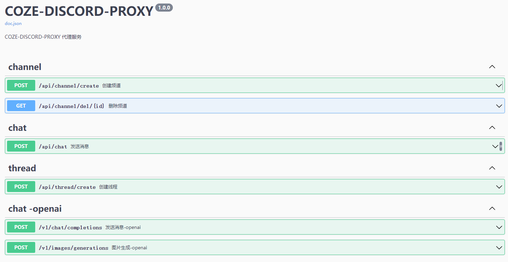

<p align="right">
   <strong>中文</strong> | <a href="./README.en.md">English</a>
</p>

<div align="center">

# coze-discord-proxy

_代理`Discord`对话`Coze-Bot`，实现以API形式请求GPT4模型，提供对话、文生图、图生文、知识库检索等功能_

_觉得有点意思的话 别忘了点个🌟_

📄<a href="https://cdp-docs.pages.dev" style="font-size: 15px;">CDP项目文档站</a>(必看教程)

🐞<a href="https://t.me/+LGKwlC_xa-E5ZDk9" style="font-size: 15px;">CDP项目-交流群</a>(交流)

📢<a href="https://t.me/+0fYkYY_zUZYzNzRl" style="font-size: 15px;">CDP项目-通知频道</a>(通知)


</div>

## 功能

- [x] 完美适配`NextChat`,`one-api`,`LobeChat`等对话面板。
- [x] 完美支持对话隔离。
- [x] 对话接口支持流式返回。
- [x] 支持创建 `discord`分类/频道/线程。
- [x] 支持和`openai`对齐的对话接口(`v1/chat/completions`)(也支持`dall-e-3`文生图)(支持指定`discord-channel`)。
- [x] 支持和`openai`对齐的图生文/图改图/文件生文接口(`v1/chat/completions`)(按照`GPT4V`接口的请求格式 [ 支持`url`或`base64` ])(支持指定`discord-channel`)。
- [x] 支持和`openai`对齐的`dall-e-3`文生图接口(`v1/images/generations`)。
- [x] 支持每日`9`点定时任务自动活跃机器人。
- [x] 支持配置多discord用户`Authorization`(环境变量`USER_AUTHORIZATION`)作请求负载均衡(**目前每个discord用户调用coze-bot在24h内有次数[限制](#限制),可配置多用户来实现叠加请求次数及请求负载均衡**)。
- [x] 支持配置多coze机器人作响应负载均衡 (通过`PROXY_SECRET`/`model`指定) 详细请看[进阶配置](#进阶配置)。

### 接口文档:

`http://<ip>:<port>/swagger/index.html`

<span></span>

### 示例:

<span></span>

## 如何使用

1. 打开 [discord官网](https://discord.com/app) ,登陆后点击设置-高级设置-开发者模式-打开。
2. 创建discord服务器,右键点击此服务器选择`复制服务器ID(GUILD_ID)`并记录,在此服务器中创建默认频道,右键点击此频道选择`复制频道ID(CHANNEL_ID)`并记录。
3. 打开 [discord开发者平台](https://discord.com/developers/applications) 登陆。
4. 创建新应用-Bot即`COZE-BOT`,并记录该bot专属的`token`和`id(COZE_BOT_ID)`,此bot为即将被coze托管的bot。
5. 创建新应用-Bot即`CDP-BOT`,并记录该bot专属的`token(BOT_TOKEN)`,此bot为监听discord消息的bot。
6. 两个bot开通对应权限(`Administrator`)并邀请进创建好的discord服务器 (过程不在此赘述)。
7. 打开 [discord官网](https://discord.com/app)进入服务器,按F12打开开发者工具,在任一频道内发送一次消息,在开发者工具-`Network`中找到请求 `https://discord.com/api/v9/channels/1206*******703/messages`从该接口header中获取`Authorization(USER_AUTHORIZATION)`并记录。
8. 打开 [coze官网](https://www.coze.com) 创建bot并进行个性化配置(注意`Auto-Suggestion`为`Default/on`(默认不用改))。
9. 配置好后选择发布到discord,填写`COZE-BOT`的`token`,发布完成后在discord服务器中可看到`COZE-BOT`在线并可以@使用。
10. 使用上述记录的参数开始配置[环境变量](#环境变量)并[部署](#部署)本项目。
11. 访问接口文档地址,即可开始调试或集成其他项目。

## 如何集成NextChat

填 接口地址(ip:端口/域名) 及 API-Key(`PROXY_SECRET`),其它的随便填随便选。

> 如果自己没有搭建NextChat面板,这里有个已经搭建好的可以使用 [NextChat](https://ci.goeast.io/)

<span></span>

## 如何集成one-api

填 `BaseURL`(ip:端口/域名) 及 密钥(`PROXY_SECRET`),其它的随便填随便选。

<span></span>

## 部署

### 基于 Docker-Compose(All In One) 进行部署

```shell
docker-compose pull && docker-compose up -d
```

#### docker-compose.yml

```docker
version: '3.4'

services:
  coze-discord-proxy:
    image: deanxv/coze-discord-proxy:latest
    container_name: coze-discord-proxy
    restart: always
    ports:
      - "7077:7077"
    volumes:
      - ./data:/app/coze-discord-proxy/data
    environment:
      - USER_AUTHORIZATION=MTA5OTg5N************aXUBHVI  # 必须修改为我们discord用户的授权密钥(多个请以,分隔)
      - BOT_TOKEN=MTE5OT************UrUWNbG63w  # 必须修改为监听消息的Bot-Token
      - GUILD_ID=11************96  # 必须修改为两个机器人所在的服务器ID
      - COZE_BOT_ID=11************97  # 必须修改为由coze托管的机器人ID
      - CHANNEL_ID=11************94  # [可选]默认频道-(目前版本下该参数仅用来活跃机器人)
      - PROXY_SECRET=123456  # [可选]接口密钥-修改此行为请求头校验的值(多个请以,分隔)
      - TZ=Asia/Shanghai
```

### 基于 Docker 进行部署

```docker
docker run --name coze-discord-proxy -d --restart always \
-p 7077:7077 \
-v $(pwd)/data:/app/coze-discord-proxy/data \
-e USER_AUTHORIZATION="MTA5OTg5N************uIfytxUgJfmaXUBHVI" \
-e BOT_TOKEN="MTE5OTk2************rUWNbG63w" \
-e GUILD_ID="11************96" \
-e COZE_BOT_ID="11************97" \
-e PROXY_SECRET="123456" \
-e CHANNEL_ID="11************24" \
-e TZ=Asia/Shanghai \
deanxv/coze-discord-proxy
```

其中`USER_AUTHORIZATION`,`BOT_TOKEN`,`GUILD_ID`,`COZE_BOT_ID`,`PROXY_SECRET`,`CHANNEL_ID`修改为自己的。

如果上面的镜像无法拉取,可以尝试使用 GitHub 的 Docker 镜像,将上面的`deanxv/coze-discord-proxy`替换为`ghcr.io/deanxv/coze-discord-proxy`即可。

### 部署到第三方平台

<details>
<summary><strong>部署到 Zeabur</strong></summary>
<div>

> Zeabur 的服务器在国外,自动解决了网络的问题,同时免费的额度也足够个人使用

点击一键部署:

[](https://zeabur.com/templates/GMU8C8?referralCode=deanxv)

**一键部署后 `USER_AUTHORIZATION`,`BOT_TOKEN`,`GUILD_ID`,`COZE_BOT_ID`,`PROXY_SECRET`,`CHANNEL_ID`变量也需要替换！**

或手动部署:

1. 首先 **fork** 一份代码。
2. 进入 [Zeabur](https://zeabur.com?referralCode=deanxv),使用github登录,进入控制台。
3. 在 Service -> Add Service,选择 Git（第一次使用需要先授权）,选择你 fork 的仓库。
4. Deploy 会自动开始,先取消。
5. 添加环境变量

   `USER_AUTHORIZATION:MTA5OTg5N************uIfytxUgJfmaXUBHVI`  主动发送消息的discord用户的授权密钥(多个请以,分隔)

   `BOT_TOKEN:MTE5OTk************WNbG63w`  监听消息的Bot-Token

   `GUILD_ID:11************96`  两个机器人所在的服务器ID

   `COZE_BOT_ID:11************97` 由coze托管的机器人ID

   `CHANNEL_ID:11************24`  # [可选]默认频道-(目前版本下该参数仅用来活跃机器人)

   `PROXY_SECRET:123456` [可选]接口密钥-修改此行为请求头校验的值(多个请以,分隔)(与openai-API-KEY用法一致)

保存。

6. 选择 Redeploy。

</div>


</details>

<details>
<summary><strong>部署到 Render</strong></summary>
<div>

> Render 提供免费额度,绑卡后可以进一步提升额度

Render 可以直接部署 docker 镜像,不需要 fork 仓库：[Render](https://dashboard.render.com)

</div>
</details>

## 配置

### 环境变量

1. `USER_AUTHORIZATION=MTA5OTg5N************uIfytxUgJfmaXUBHVI`  主动发送消息的discord用户的授权密钥(多个请以,分隔)
2. `BOT_TOKEN=MTE5OTk2************rUWNbG63w`  监听消息的Bot-Token
3. `GUILD_ID=11************96`  所有Bot所在的服务器ID
4. `COZE_BOT_ID=11************97`  由coze托管的Bot-ID
5. `PORT=7077`  [可选]端口,默认为7077
6. `SWAGGER_ENABLE=1`  [可选]是否启用Swagger接口文档[0:否;1:是] (默认为1)
7. `ONLY_OPENAI_API=0`  [可选]是否只暴露与openai对齐的接口[0:否;1:是] (默认为0)
8. `CHANNEL_ID=11************24`  [可选]默认频道-(目前版本下该参数仅用来活跃Bot)
9. `PROXY_SECRET=123456`  [可选]接口密钥-修改此行为请求头校验的值(多个请以,分隔)(与openai-API-KEY用法一致),**推荐使用此环境变量**
10. `DEFAULT_CHANNEL_ENABLE=0`  [可选]是否启用默认频道[0:否;1:是] (默认为0) 启用后每次对话都会在默认频道中,**会话隔离会失效**,**推荐不使用此环境变量**
11. `ALL_DIALOG_RECORD_ENABLE=1`  [可选]是否启用全量上下文[0:否;1:是] (默认为1) 关闭后每次对话只会发送`messages`中最后一个`role`为`user`的`content`,**推荐不使用此环境变量**
12. `CHANNEL_AUTO_DEL_TIME=5`  [可选]频道自动删除时间(秒) 此参数为每次对话完成后自动删除频道的时间(默认为5s),为0时则不删除,**推荐不使用此环境变量**
13. `COZE_BOT_STAY_ACTIVE_ENABLE=1`  [可选]是否开启每日`9`点活跃coze-bot的定时任务[0:否;1:是] (默认为1),**推荐不使用此环境变量**
14. `REQUEST_OUT_TIME=60`  [可选]对话接口非流响应下的请求超时时间,**推荐不使用此环境变量**
15. `STREAM_REQUEST_OUT_TIME=60`  [可选]对话接口流响应下的每次流返回超时时间,**推荐不使用此环境变量**
16. `REQUEST_RATE_LIMIT=60`  [可选]每分钟下的单ip请求速率限制,默认:60次/min
17. `USER_AGENT=Mozilla/5.0 (Macintosh; Intel Mac OS X 10_15_7) AppleWebKit/537.36 (KHTML, like Gecko) Chrome/121.0.0.0 Safari/537.36`  [可选]discord用户端Agent,使用自己的可能有效防止被ban,不设置时默认使用作者的 推荐使用此环境变量
18. `NOTIFY_TELEGRAM_BOT_TOKEN=6232***********Niz9c`  [可选]作为通知TelegramBot的Token(通知事件:1.无可用`user_authorization`;2.`BOT_TOKEN`关联的BOT触发风控)
19. `NOTIFY_TELEGRAM_USER_ID=10******35`  [可选]`NOTIFY_TELEGRAM_BOT_TOKEN`关联的`Telegram-Bot`推送至该变量关联的`Telegram-User`(**`NOTIFY_TELEGRAM_BOT_TOKEN`不为空时该变量也不可为空**)
20. `PROXY_URL=http://127.0.0.1:10801`  [可选]代理(仅支持http)

## 进阶配置

### 配置多机器人

1. 部署前在`docker`/`docker-compose`部署同级目录下创建`data/config/bot_config.json`文件
2. 编写该`json`文件,`bot_config.json`格式如下

```shell
[
  {
    "proxySecret": "123", // 接口请求密钥(PROXY_SECRET)(注意:此密钥在环境变量PROXY_SECRET中存在时该Bot才可以被匹配到!)
    "cozeBotId": "12***************31", // coze托管的机器人ID
    "model": ["gpt-3.5","gpt-3.5-16k"], // 模型名称(数组格式)(与请求参数中的model对应,如请求中的model在该json中未匹配到则会抛出异常)
    "channelId": "12***************56"  // [可选]discord频道ID(机器人必须在此频道所在的服务器)(目前版本下该参数仅用来活跃机器人)
  },
  {
    "proxySecret": "456",
    "cozeBotId": "12***************64",
    "model": ["gpt-4","gpt-4-16k"],
    "channelId": "12***************78"
  },
  {
    "proxySecret": "789",
    "cozeBotId": "12***************12",
    "model": ["dall-e-3"],
    "channelId": "12***************24"
  }
]
```

3. 重启服务

> 当有此json配置时,会通过请求头携带的[请求密钥]+请求体中的[`model`]联合匹配此配置中的`cozeBotId`
> 若匹配到多个则随机选择一个。配置很灵活,可以根据自己的需求进行配置。

第三方平台(如: `zeabur`)部署的服务需要[配置多机器人]请参考[issue#30](https://github.com/deanxv/coze-discord-proxy/issues/30)

## 限制

目前的coze对每个discord用户做了标识,在discord中每个用户对不同的模型的调用有次数限制,具体如下:

```
GPT-4 Turbo (128k) - 50次/天
GPT-4 (8k) - 100次/天
GPT-3.5 (16k) - 500次/天
```
可配置多discord用户`Authorization`(参考[环境变量](#环境变量)`USER_AUTHORIZATION`)实现叠加请求次数及请求负载均衡。

## Q&A

Q: 并发量高时应如何配置？

A: 首先为服务[配置多机器人](#配置多机器人)用来作响应bot的负载,其次准备多个discord账号用来作请求负载并邀请进同一个服务器,获取每个账号的`Authorization`英文逗号分隔配置在环境变量`USER_AUTHORIZATION`中,此时每次请求都会从多个discord账号中取出一个发起对话,有效实现负载均衡。

## ⭐ Star History

[](https://star-history.com/#deanxv/coze-discord-proxy&Date)

## 相关

[GPT-Content-Audit](https://github.com/deanxv/gpt-content-audit):聚合Openai、阿里云、百度智能云、七牛云等开放平台，提供与`openai`请求格式对齐的内容审核前置服务。

## 其他

**开源不易,若你参考此项目或基于此项目二开可否麻烦在你的项目文档中标识此项目呢？谢谢你！**

Java: https://github.com/oddfar/coze-discord (目前不可用)

## 引用

Coze 官网 : https://www.coze.com

Discord 开发地址 : https://discord.com/developers/applications


